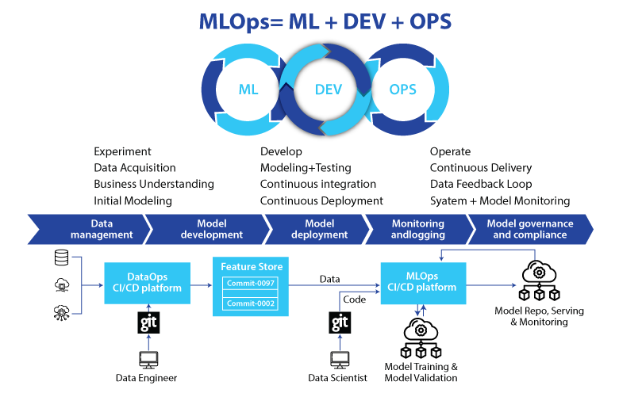

# 🧩 Proyecto Base ETL + MLOps



Este repositorio es un **proyecto base de ETL** orientado al aprendizaje de **Ingeniería de Datos** y al despliegue de prácticas de **MLOps**.  

El objetivo es enseñar cómo **extraer, transformar y cargar datos (ETL)**, mantener un flujo de trabajo reproducible, automatizado y con integración continua a través de **GitHub Actions**.


---

## 🚀 Objetivos del Proyecto

    - Diseñar un **pipeline ETL** modular en Python.
    - Almacenar datos en una **base de datos SQLite**.
    - Integrar principios de **MLOps**:
    - Versionado de código.
    - Automatización con GitHub Actions.
    - Documentación reproducible.
    - Servir como **plantilla base** para proyectos educativos de estudiantes de **Ingeniería de Datos**.

---

## 📂 Estructura del Proyecto

```bash
    .
    ├── .github/workflows        # Configuración de CI/CD con GitHub Actions
    │   └── main.yml
    ├── .vscode                  # Configuración del entorno en VSCode
    │   └── launch.json
    ├── docs                     # Documentación y diagramas
    │   ├── diseno.drawio
    │   └── MLOps.png
    ├── src/prueba_etl           # Scripts de ejemplo ETL
    │   └── __pycache__
    ├── static/db                # Base de datos y scripts auxiliares
    │   ├── database.sqlite
    │   ├── cargar.py
    │   ├── database.py
    │   ├── extractor.py
    │   ├── main.py
    │   ├── modelar.py
    │   └── transformar.py
    ├── .gitignore               # Archivos/carpetas ignoradas en Git
    ├── README.md                # Documentación principal
    └── setup.py                 # Configuración del paquete

📊 Diagrama del Flujo ETL + MLOps

Este diagrama resume la arquitectura del pipeline:

    ⚙️ Instalación
        1️⃣ Clonar el repositorio
            git clone https://github.com/andresfkyjas/iidsd_20252_1.git.git
            cd iidsd_20252_1

        2️⃣ Crear y activar un entorno virtual
            python -m venv venv
            source venv/bin/activate   # Linux/Mac
            venv\Scripts\activate      # Windows

        3️⃣ Instalar dependencias
            si deseas instalar como paquete:
            pip install -e .

        ▶️ Ejecución del Pipeline

            Ejecutar el flujo ETL completo:
            python static/db/main.py

🔄 CI/CD con GitHub Actions

    Este proyecto incluye un workflow en .github/workflows/main.yml que permite:

    Verificar dependencias e instalación.

    Ejecutar el pipeline ETL automáticamente.

    Preparar el entorno para despliegues futuros.

    Despliegue automático

    Cada vez que haces un push o un pull request hacia la rama principal:

    GitHub Actions valida la instalación.

    Ejecuta los scripts de prueba.

    Deja listo el entorno para que los estudiantes puedan ver resultados.

📚 MLOps en este Proyecto

    Este repositorio implementa buenas prácticas de MLOps, incluyendo:

    Modularidad: cada etapa del ETL está en un script independiente.

    Reproducibilidad: uso de setup.py y entornos virtuales.

    Automatización: integración con GitHub Actions.

    Versionado: uso de Git para rastrear cambios de código y base de datos.

    Escalabilidad educativa: pensado como punto de partida para prácticas más avanzadas (Docker, MLFlow, Kubernetes, etc.).

🗄️ Base de Datos

    Motor: SQLite

    Ubicación: static/db/database.sqlite

    Administración: vía database.py

    Esto permite a los estudiantes trabajar sin necesidad de configurar un motor externo.